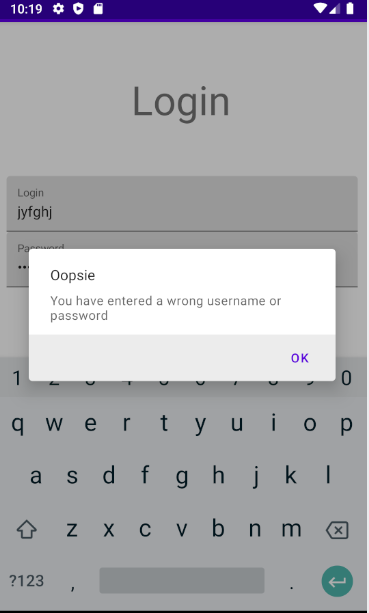
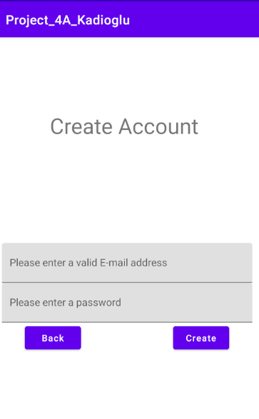

# Mobile Project by Kadioglu Onur Can

## Introduction

This is a project given to us by our Mobile programming teacher.
We needed to finish this project in 2-3 months after it was given.
In this project we use CLean Architecture and MVVM pattern in Android Studio
Also we have a database in which we can crate or get our user and password 
And I made something clearly not 100% finished but modifiable that it can give any Github users an idea on how to continue my project

## What we need for this project

- We need to install Android Studio
- We need to find a good API that we can follow 

## I  nstructions to respect

- Clean Architecture & MVVM
- REST
- Displaying an element of the list
- RecycleView Display
- Screens : 4 activities, 1 fragment

## What it looks like

### This is the screen when we press the app icon

It shows us the login page 

### This is the screen when we enter a wrong login

### This is when we press the create button

it shows us a screen that we need to enter our credentials to create an account

### After we enter our credentials in our login segment we can see the following

https://prnt.sc/wd5mex

It shows us the detail of the pokemon here it's name and it's picture
