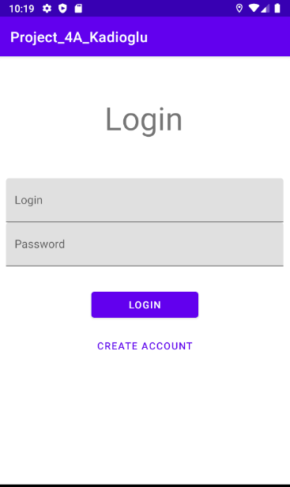
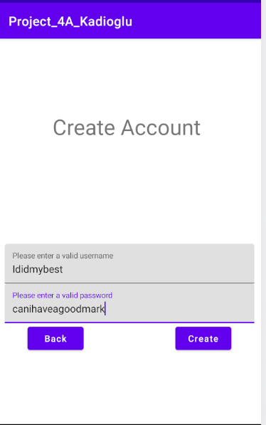
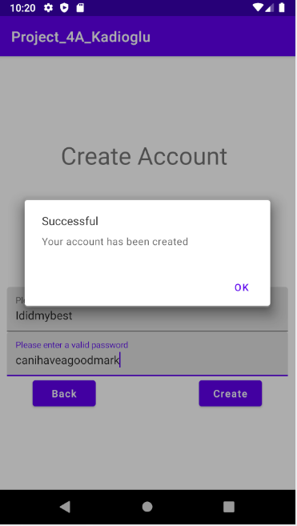
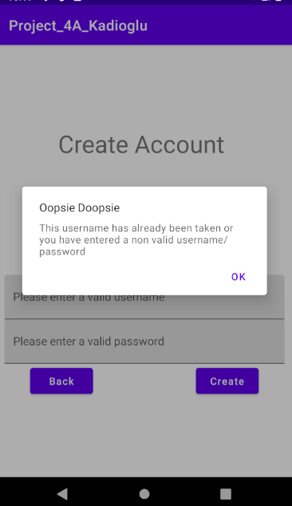
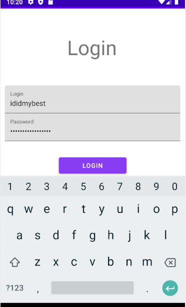
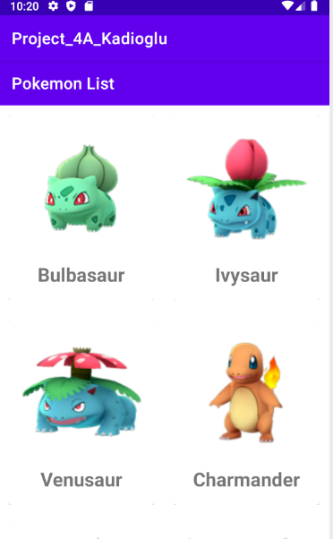

# Mobile Project by Kadioglu Onur Can

## Introduction

This is a project given to us by our Mobile programming teacher.
We needed to finish this project in 2-3 months after it was given.
In this project we use CLean Architecture and MVVM pattern in Android Studio
Also we have a database in which we can crate or get our user and password 
And I made something not 100% finished but modifiable that it can give any Github users an idea on how to continue my project

## What we need for this project

- We need to install Android Studio
- We need to find a good API that we can follow 

## Instructions to respect

- Clean Architecture & MVVM
- REST
- Displaying an element of the list
- RecycleView Display
- Screens : 4 activities, 1 fragment
 
 
## What it looks like

 
### This is the screen when we press the app icon

It shows us the login page 

### This is the screen when we enter a wrong login

 
 

### This is when we press the create button

it shows us a screen that we need to enter our credentials to create an account
 
 
### After we enter our credentials in our create segment we can see the following

It shows us the detail of the pokemon here it's name and it's picture
 
 
### This is what happens when we enter already taken or wrong credentials

 
 
### And when we enter our credentials in the login screeen we open the database

 
 

## PS

the pokemon database was made with the help of the videos of EDMT Dev
link to the video the helped me:
https://www.youtube.com/watch?v=WDKoFZNLEKg

